# FitFlex
FitFlex is a digital platform offering personalized workout routines for all fitness levels. With an intuitive design, users can easily browse and purchase plans tailored to specific goals like weight loss, muscle gain, and endurance. Each plan includes video demos, progress tracking, and community support for a motivating experience. Flexible payment options—such as one-time purchases and subscriptions—make FitFlex accessible for everyone, whether at home or on the go.

## SEO and Marketing Research
### Keyword Research
<details>
  <summary><strong>Gym Workouts Keywords</strong></summary>

  <h3>Primary Keywords:</h3>
  <ul>
    <li><strong>Gym workout plans:</strong> Plans for users to follow while working out at the gym.</li>
    <li><strong>Gym fitness programs:</strong> Structured programs that guide users through their fitness journey in the gym.</li>
    <li><strong>Custom gym routines:</strong> Tailored routines based on individual needs and fitness goals.</li>
    <li><strong>Strength training workout plans:</strong> Plans focused on building strength through weight lifting and resistance exercises.</li>
    <li><strong>Gym workouts for muscle gain:</strong> Routines designed to increase muscle size and strength.</li>
  </ul>

  <h3>Long-Tail Keywords:</h3>
  <ul>
    <li><strong>Best gym workout plans for beginners:</strong> Specifically aimed at people new to the gym.</li>
    <li><strong>Custom gym workout plans for weight loss:</strong> Routines that help users lose weight while building strength.</li>
    <li><strong>Gym training routines for advanced athletes:</strong> Challenging workout plans for experienced users.</li>
    <li><strong>Full-body strength workout plan for the gym:</strong> A comprehensive routine to target the entire body for strength training.</li>
    <li><strong>Gym workout plans to build muscle fast:</strong> Focused on muscle hypertrophy with intensity and progressive overload.</li>
    <li><strong>6-week gym workout for strength and conditioning:</strong> A short-term program to build strength and conditioning within six weeks.</li>
  </ul>

  <h3>LSI (Latent Semantic Indexing) Keywords:</h3>
  <ul>
    <li><strong>Gym exercise routines:</strong> A broad category of workout plans for all fitness levels.</li>
    <li><strong>Weight training program:</strong> A structured workout focusing on building strength through resistance training.</li>
    <li><strong>Muscle building gym routines:</strong> Targeted gym routines for muscle growth.</li>
    <li><strong>Cardio and strength training gym workout:</strong> A combination of cardio and strength exercises for balanced fitness.</li>
    <li><strong>Gym fitness challenge plans:</strong> Short-term, goal-focused fitness challenges for gym-goers.</li>
  </ul>
</details>

<details>
  <summary><strong>Home Workouts Keywords</strong></summary>

  <h3>Primary Keywords:</h3>
  <ul>
    <li><strong>Home workout plans:</strong> Fitness routines that can be done at home with or without equipment.</li>
    <li><strong>Best home fitness routines:</strong> Effective and popular workout routines for home-based fitness.</li>
    <li><strong>Custom home workouts:</strong> Tailored workout plans that suit individual needs for home-based fitness.</li>
    <li><strong>Home workouts for beginners:</strong> Simple and easy-to-follow workout plans for people starting their fitness journey at home.</li>
    <li><strong>At-home workout routines for weight loss:</strong> Home workouts designed to help individuals lose weight effectively.</li>
  </ul>

  <h3>Long-Tail Keywords:</h3>
  <ul>
    <li><strong>Best home workout plans for muscle gain:</strong> Home-based plans for building muscle without the need for a gym.</li>
    <li><strong>Full-body home workout routine without equipment:</strong> Comprehensive bodyweight routines to be done at home without any equipment.</li>
    <li><strong>Home workout programs for busy people:</strong> Short, effective workouts for those with limited time.</li>
    <li><strong>Home workouts for fat loss and toning:</strong> Fat-burning and toning exercises for home use.</li>
    <li><strong>30-minute home workout plans for beginners:</strong> Quick, beginner-friendly workout plans that can be done at home in 30 minutes.</li>
    <li><strong>Home exercises to build muscle without weights:</strong> Strength-building exercises that don't require any gym equipment.</li>
  </ul>

  <h3>LSI (Latent Semantic Indexing) Keywords:</h3>
  <ul>
    <li><strong>No equipment home workouts:</strong> Routines that focus on bodyweight exercises for home use.</li>
    <li><strong>Home fitness challenges:</strong> Short-term, engaging challenges that encourage home workout participation.</li>
    <li><strong>Full-body workout at home:</strong> A workout plan that targets all muscle groups using home-friendly exercises.</li>
    <li><strong>Quick home workouts for weight loss:</strong> Short, intense workouts that are focused on burning fat at home.</li>
    <li><strong>Beginner at-home fitness routine:</strong> Simple, introductory fitness routines for people starting their fitness journey at home.</li>
  </ul>
</details>

### Business Model
<details>
  <summary><strong>How does FitFlex make money?</strong></summary>
  <ul>
    <li>One-time purchases of workout plans</li>
    <li>Premium content (e.g., expert coaching, advanced plans)</li>
  </ul>
</details>

<details>
  <summary><strong>Who is the target audience?</strong></summary>
  <ul>
    <li>Fitness beginners, intermediate, and advanced users</li>
    <li>People who prefer home workouts or gym routines</li>
    <li>Busy professionals or those looking for flexible workout plans</li>
    <li>Gym-goers seeking personalized or structured workout plans</li>
  </ul>
</details>

<details>
  <summary><strong>What makes FitFlex unique?</strong></summary>
  <ul>
    <li>Customizable workout plans for both home and gym</li>
    <li>Easy-to-follow workout videos and progress tracking</li>
    <li>Focus on both beginners and advanced fitness levels</li>
  </ul>
</details>

<details>
  <summary><strong>How will FitFlex acquire customers?</strong></summary>
  <ul>
    <li>Social media marketing (Facebook)</li>
    <li>SEO (targeting specific workout-related keywords)</li>
  </ul>
</details>

<details>
  <summary><strong>Where will FitFlex sell?</strong></summary>
  <ul>
    <li>Main website (for subscriptions and workout purchases)</li>
    <li>Social media platforms (for marketing and traffic generation)</li>
  </ul>
</details>

### Newsletter
This is present on the footer of every page, a form to sign up for newsletter.  It is a dummy input form that yield a message of success when user clicks subscribe.

### Social media
A Facebook page was created for the store.
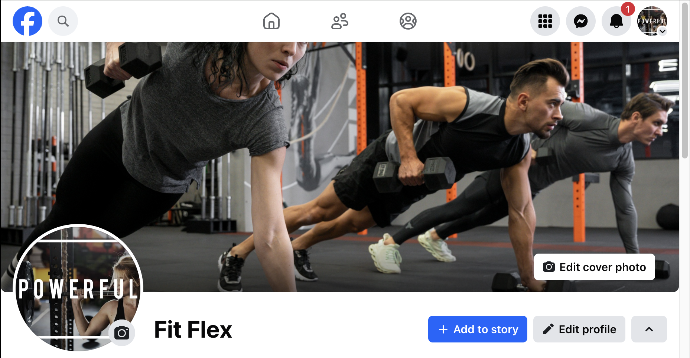

### Meta tags

```html
<meta name="description" content="Start your fitness journey with FitFlex. Personalized programs tailored to your needs, whether you're a beginner or a pro. Get started today!">
<meta name="keywords" content="Fitness, Personalized Programs, Health, Workout, Gym, FitFlex">
```

## Features

### Nav bar and logo
**Home Page**

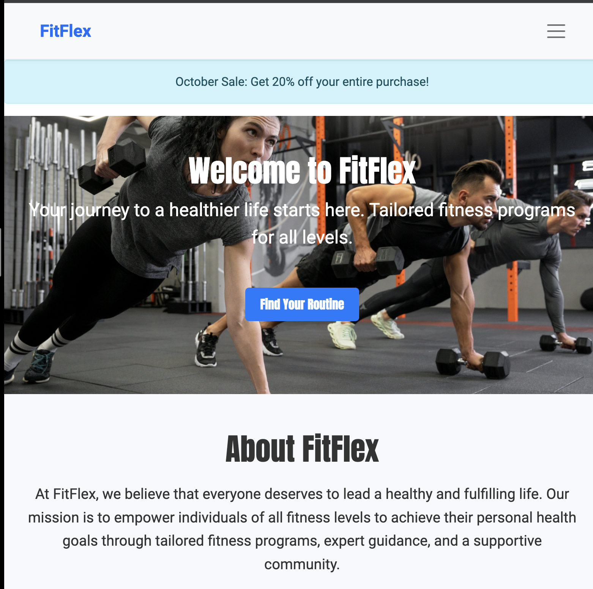
A user on the home page gets introduced to a hero section with an image of people working out, a discount banner(present through out the website) and a CTA that states 'Get started' if user is not logged in and 'Find your routine' if user is. The former button directs user to the sign up page and the latter to the product page.

Following this is the about section and then the contact page.
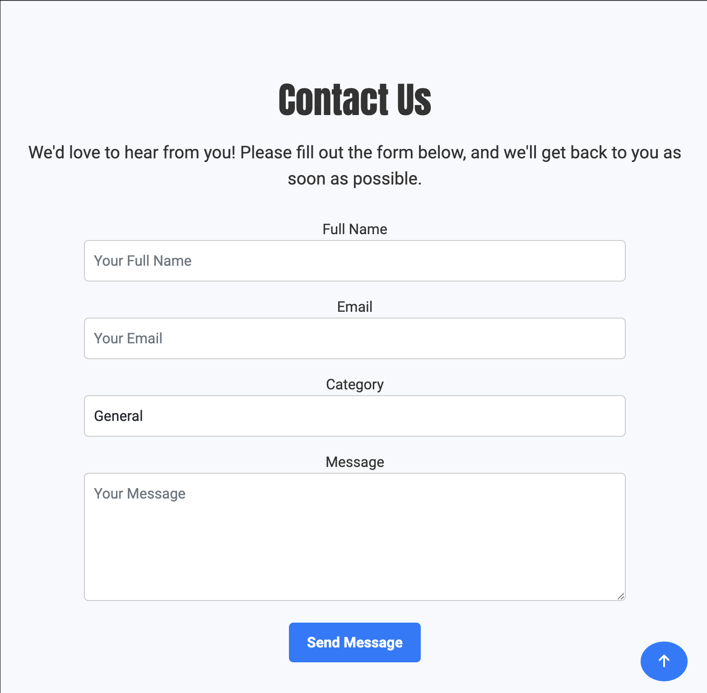

**Header**
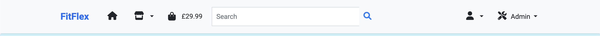

A simple responsive navbar present in all pages
* logo navigates user back to home
* Home icons, shop icon, bag icon, search bar represent the respective functionalities.

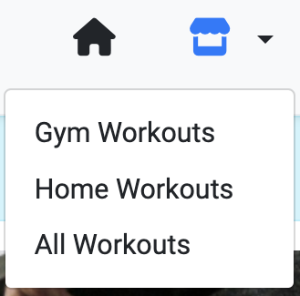

Shop icon has a drop down to reveal gym workout,homeworkout, all workout. Filter buttons that direct user to product page and will reveal products related to the filter.

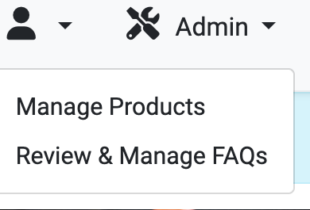

Admin is only display if user is authenticated. A dropdown appears allowing admin to manage products or review FAQs.

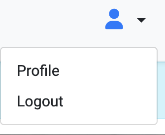

Profile is available to both admin and general user. The profile button directs user to a page where they can veiw their order history as well as update their profile information as seen below:

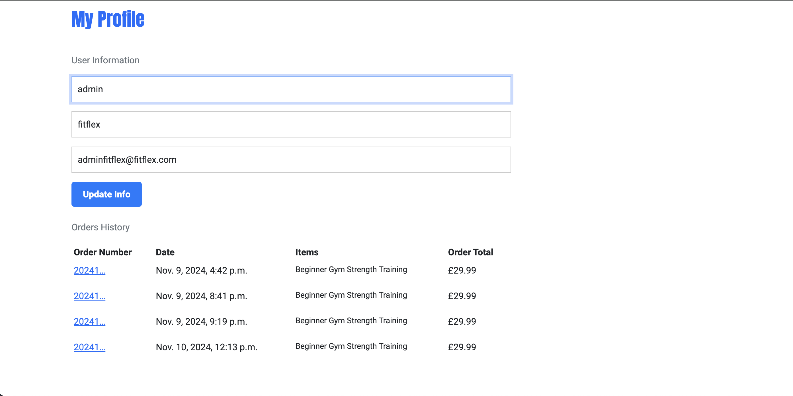

**Footer**
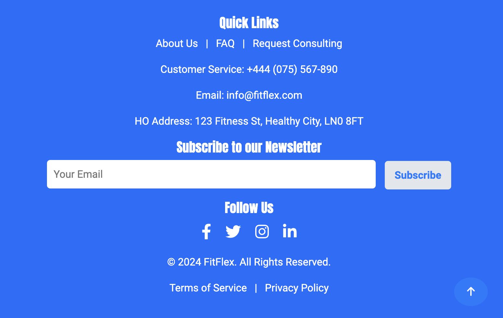

The footer is consistent through out the website. It has details for contact, copyright, dummy newsletter which releases a success taost, FAQ button that directs user to the FAQ app.

**FAQ**
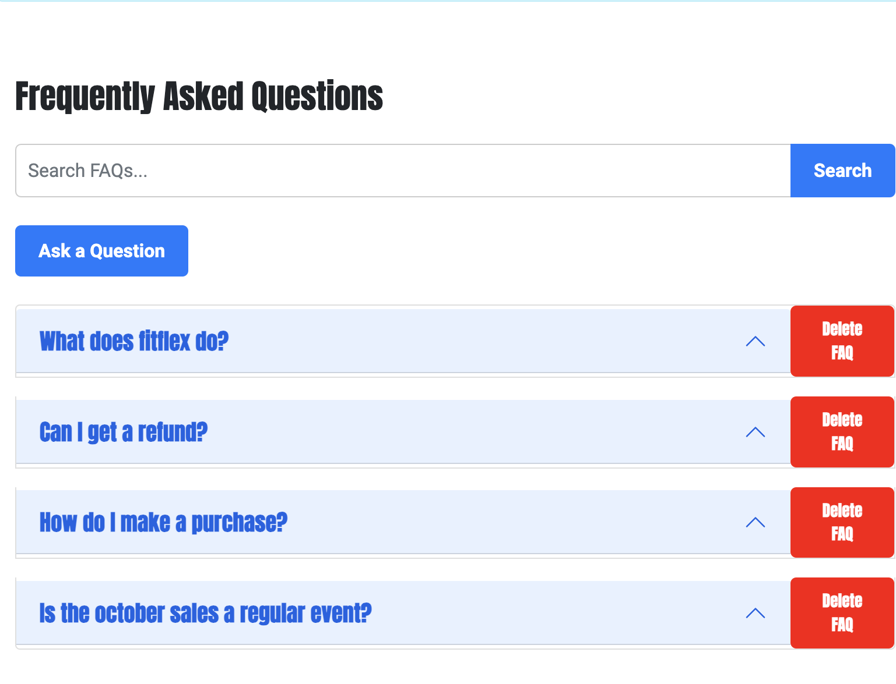

The faq page allows user to access answers to questions they may have. The delete buttons seen is a functionality provide only to admin. 
Users can also ask questions by click on the `Ask question` button so that they are direct to the user_question page:

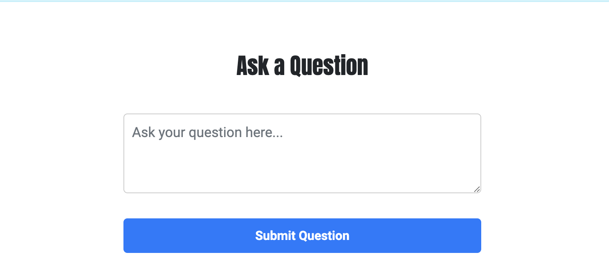

These questions are able to be reviewed, answered or deleted by admin via this interface:

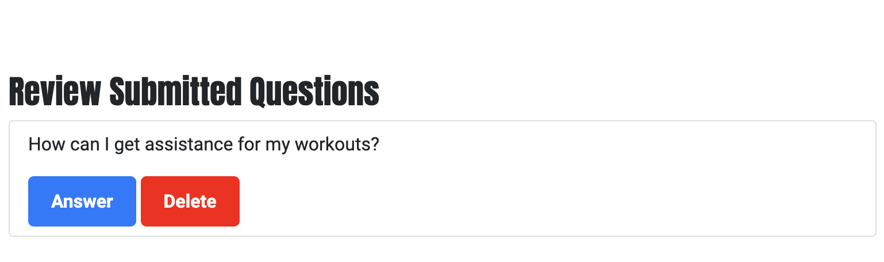

#### Workout Program functions

**Workout page**
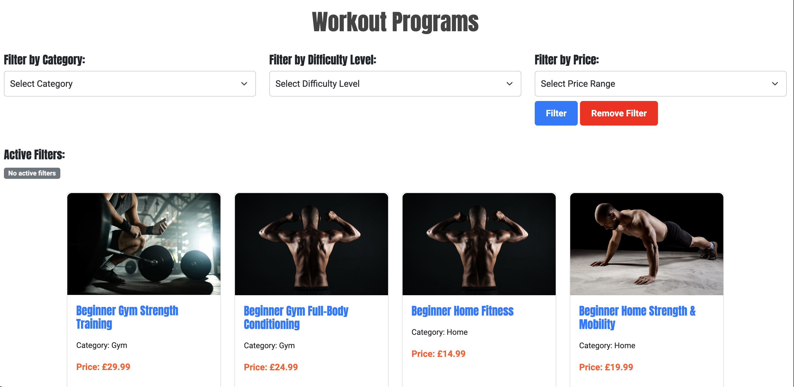

The workout page contains a filter section that allows user to filter based category, difficulty level and reorder based on price. Each workout product includes an image, price and a readmore button that directs user to the produtc's detail page.

**Product detail**
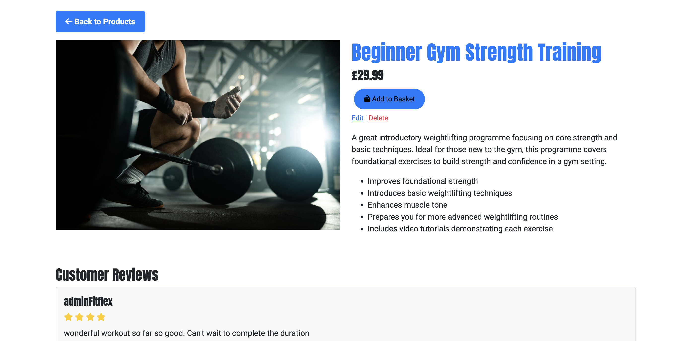
The workout detail includes the product description as well as reviews. It also has a button that ensure the product is added to the bag for purchase.

**Product review**

The review functionality allows user to add a rating up to five stars to the product as well as add comments. There is also authentication privileges:
* Only a user can edit or delete their own comment
* Admin can only delete any comment.

#### Checkout
**Bag**
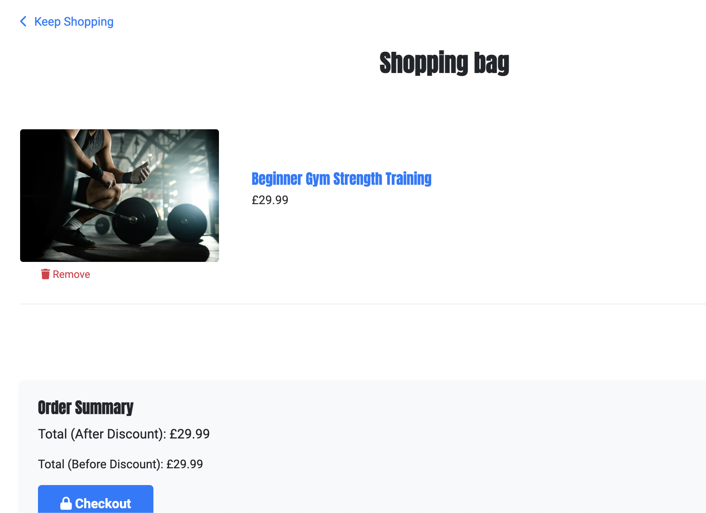

It holds product details like names, prices,images and any applied discounts, allowing users to review their selections. When you clcicks on the checkout button, they are directed to a checkout page.

**checkout**
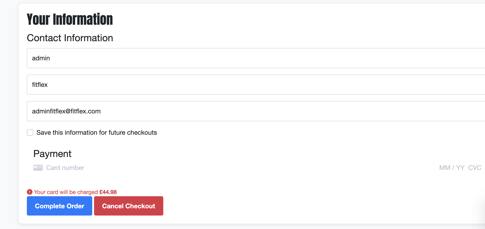

At checkout, the checkoutbag calculates the order total, including discounts and integrates with payment gateways to complete the transaction. This feature provides users with a clear summary of their order and ensures a smooth, transparent checkout experience. User have to enter details such as their names and email which will automatically be set fif they are authenticated. They also have to input their card details.
If payment is completed, user gets directed to checkout sucess page below:
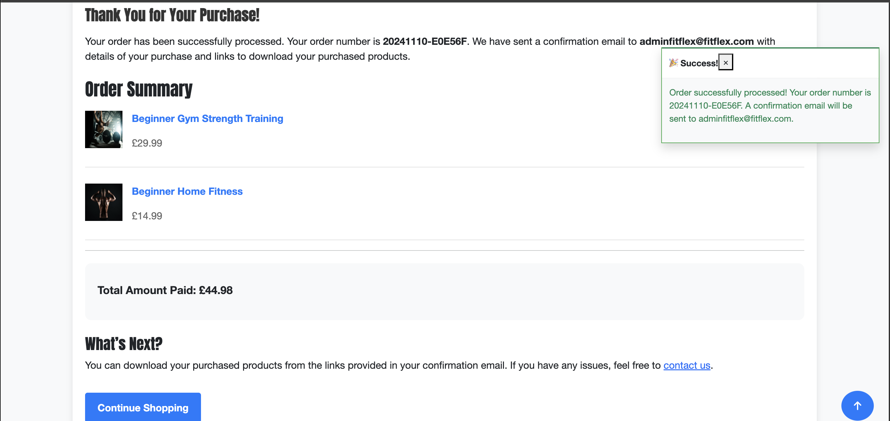

The checkout success page display order and confirmation of purchase. It also shows a button, `continue shopping`, that directs user back to product page.

#### Toasts
Toasts are present through out the website and are triggered in response to user activity such as click a button. Depending on the action, a success, an alert, error or info message will be shown
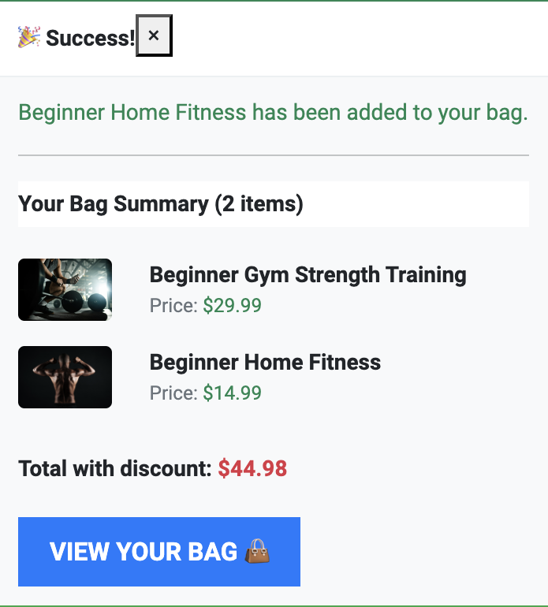

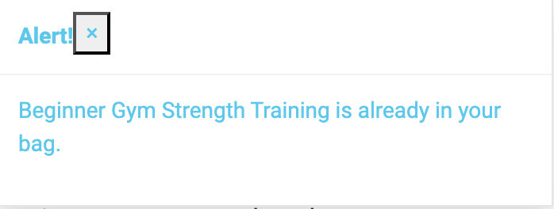

# Design
## Modeling and Wireframing
## Agile Methodology
## Technologies
#### **Frontend:**
- **HTML5**  
  HTML is used for structuring the content on the web, ensuring a clear and semantic layout for the pages.

- **CSS3**  
  CSS is used to style the app, ensuring it is visually appealing and responsive across various screen sizes. 

- **Bootstrap 5**  
  Bootstrap 5 is used as a front-end framework to speed up development and ensure a mobile-first, responsive design. 

#### **Backend:**
- **Django**  
  Django is used as the backend framework. 

- **AWS S3**  
  AWS S3 is used for storing static assets such as static files and documents. 

#### **Authentication & Email:**
- **Gmail API**  
  The Gmail API is used to send automated emails, such as registration confirmation, and payment receipts. It helps manage communication with users seamlessly.

- **Stripe API**  
  Stripe is integrated for handling secure payment processing and managing subscription models. It allows users to pay for premium workout plans.

#### **Deployment & Hosting:**
- **Heroku**  
  Heroku is used for deploying and hosting the backend (Django app). 

#### **Design & Planning:**
- **Balsamiq Wireframes**  
  Balsamiq is used for wireframing and prototyping the app’s UI. It helps in visualizing the layout and user experience (UX) before development begins.

#### **Version Control:**
- **Git & GitHub**  
  Git is used for version control, and GitHub is used to manage the project’s codebase. It enables collaboration, version tracking, and code review.

# Deployment

# Testing and Validation

<details>
  <summary>Test Cases for Features</summary>
  <table>
    <thead>
      <tr>
        <th>Feature</th>
        <th>Expected Outcome</th>
        <th>Pass/Fail</th>
      </tr>
    </thead>
    <tbody>
      <tr>
        <td>Home Page - Hero Section</td>
        <td>"Get Started" or "Find Your Routine" button directs user to the appropriate page based on login status.</td>
        <td>Pass</td>
      </tr>
      <tr>
        <td>Home Page - Contact Section</td>
        <td>"Contact Us" button directs user to the contact page.</td>
        <td>Pass</td>
      </tr>
      <tr>
        <td>Header - Logo</td>
        <td>Clicking on the logo takes the user back to the home page.</td>
        <td>Pass</td>
      </tr>
      <tr>
        <td>Header - Home Icon</td>
        <td>Clicking the home icon takes the user to the home page.</td>
        <td>Pass</td>
      </tr>
      <tr>
        <td>Header - Shop Icon</td>
        <td>Clicking the shop icon takes the user to the product page.</td>
        <td>Pass</td>
      </tr>
      <tr>
        <td>Header - Bag Icon</td>
        <td>Clicking the bag icon takes the user to the checkout bag page.</td>
        <td>Pass</td>
      </tr>
      <tr>
        <td>Header - Search Bar</td>
        <td>Clicking the search bar opens the search function (if implemented).</td>
        <td>Pass</td>
      </tr>
      <tr>
        <td>Sign In Button (Header)</td>
        <td>Clicking "Sign In" button redirects the user to the login page.</td>
        <td>Pass</td>
      </tr>
      <tr>
        <td>Sign Up Button (Header)</td>
        <td>Clicking "Sign Up" button redirects the user to the registration page.</td>
        <td>Pass</td>
      </tr>
      <tr>
        <td>Sign In Page - Login Form</td>
        <td>User can enter valid credentials, and upon submission, they are redirected to their destination (home, profile, etc.).</td>
        <td>Pass</td>
      </tr>
      <tr>
        <td>Sign Up Page - Registration Form</td>
        <td>User can register with valid details, and upon successful registration, they are redirected to their profile or home page.</td>
        <td>Pass</td>
      </tr>
      <tr>
        <td>Sign Up Page - Error Handling</td>
        <td>If invalid or missing credentials are provided, the user receives an error message indicating what needs to be corrected.</td>
        <td>Pass</td>
      </tr>
      <tr>
        <td>Logout Button (Header)</td>
        <td>Clicking the logout button redirects the user to the logout page.</td>
        <td>Pass</td>
      </tr>
      <tr>
        <td>Logout Page - Confirmation Prompt</td>
        <td>A confirmation message appears asking the user if they are sure they want to log out.</td>
        <td>Pass</td>
      </tr>
      <tr>
        <td>Logout Page - Cancel Button</td>
        <td>Clicking the "Cancel" button redirects the user back to the home page.</td>
        <td>Pass</td>
      </tr>
      <tr>
        <td>Logout Page - Sign Out Button</td>
        <td>Clicking the "Sign Out" button successfully logs the user out and redirects them to the home page or login page.</td>
        <td>Pass</td>
      </tr>
      <tr>
        <td>Footer - Contact Us Button</td>
        <td>Clicking the "Contact Us" link directs user to the contact page.</td>
        <td>Pass</td>
      </tr>
      <tr>
        <td>Footer - Newsletter Submit Button</td>
        <td>Clicking the newsletter subscription button triggers a success toast and does not navigate away.</td>
        <td>Pass</td>
      </tr>
      <tr>
        <td>Footer - Social Media Icons</td>
        <td>Clicking each social media icon navigates the user to the respective social media site (Facebook, Twitter, Instagram, etc.).</td>
        <td>Pass</td>
      </tr>
      <tr>
        <td>Footer - About Button</td>
        <td>Clicking the "About" button in the footer correctly scrolls the user down to the About section on the home page.</td>
        <td>Pass</td>
      </tr>
      <tr>
        <td>FAQ Page</td>
        <td>Clicking on FAQ questions allows users to view the full answer; admin can delete questions and users can ask a new question.</td>
        <td>Pass</td>
      </tr>
      <tr>
        <td>FAQ - Ask Question Button</td>
        <td>Clicking the "Ask Question" button directs user to the "Ask a Question" page.</td>
        <td>Pass</td>
      </tr>
      <tr>
        <td>FAQ - Review Button</td>
        <td>Admin can click to "Review" any submitted questions, directing them to the FAQ review page.</td>
        <td>Pass</td>
      </tr>
      <tr>
        <td>Workout Page - Filter</td>
        <td>Clicking any of the filter options (category, difficulty, price) updates the product list to match the filter selection.</td>
        <td>Pass</td>
      </tr>
      <tr>
        <td>Workout Page - Product Card</td>
        <td>Clicking the "Read More" button on a product card takes the user to the product detail page.</td>
        <td>Pass</td>
      </tr>
      <tr>
        <td>Product Detail Page - Add to Bag Button</td>
        <td>Clicking "Add to Bag" button adds the product to the bag and displays a toast notification confirming the action.</td>
        <td>Pass</td>
      </tr>
      <tr>
        <td>Product Detail Page - Review Button</td>
        <td>Clicking the "Add Review" button opens a review form.</td>
        <td>Pass</td>
      </tr>
      <tr>
        <td>Product Review Page - Edit/Delete Button</td>
        <td>Clicking the "Edit" or "Delete" buttons on the review allows users to edit or delete their comments (admin can delete any review).</td>
        <td>Pass</td>
      </tr>
      <tr>
        <td>Bag Page - Remove Item Button</td>
        <td>Clicking "Remove" next to an item in the bag triggers a toast confirming the removal and updates the bag contents.</td>
        <td>Pass</td>
      </tr>
      <tr>
        <td>Bag Page - Checkout Button</td>
        <td>Clicking the "Checkout" button takes the user to the checkout page.</td>
        <td>Pass</td>
      </tr>
      <tr>
        <td>Checkout Page - Payment Submit Button</td>
        <td>Clicking "Complete Order" completes the payment and redirects the user to the checkout success page.</td>
        <td>Pass</td>
      </tr>
      <tr>
        <td>Checkout Page - Cancel Checkout Button</td>
        <td>Clicking "Cancel Checkout" prompts a confirmation and returns the user to the product page if confirmed.</td>
        <td>Pass</td>
      </tr>
      <tr>
        <td>Checkout Page - Continue Shopping Button</td>
        <td>On the success page, clicking "Continue Shopping" redirects the user to the product page.</td>
        <td>Pass</td>
      </tr>
      <tr>
        <td>Checkout Bag - Remove Item Button</td>
        <td>Clicking "Remove" next to an item in the bag triggers a toast confirming the removal and updates the bag contents.</td>
        <td>Pass</td>
      </tr>
      <tr>
        <td>Checkout Bag - Checkout Button</td>
        <td>Clicking the "Checkout" button takes the user to the checkout page.</td>
        <td>Pass</td>
      </tr>
    </tbody>
  </table>
</details>
