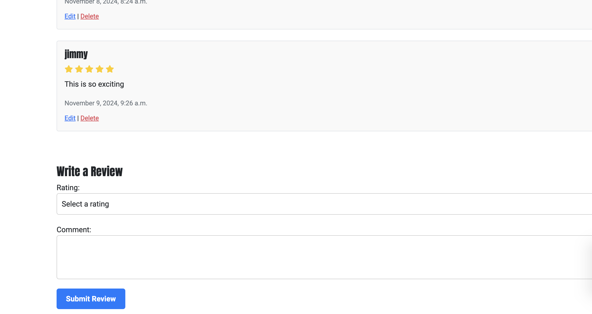

# FitFlex
FitFlex is a digital platform offering personalized workout routines for all fitness levels. With an intuitive design, users can easily browse and purchase plans tailored to specific goals like weight loss, muscle gain, and endurance. Each plan includes video demos, progress tracking, and community support for a motivating experience. 

[live website](https://fitflexapp-e29fb3bd789f.herokuapp.com/)


## SEO and Marketing Research
### Keyword Research
<details>
  <summary><strong>Gym Workouts Keywords</strong></summary>

  <h3>Primary Keywords:</h3>
  <ul>
    <li><strong>Gym workout plans:</strong> Plans for users to follow while working out at the gym.</li>
    <li><strong>Gym fitness programs:</strong> Structured programs that guide users through their fitness journey in the gym.</li>
    <li><strong>Custom gym routines:</strong> Tailored routines based on individual needs and fitness goals.</li>
    <li><strong>Strength training workout plans:</strong> Plans focused on building strength through weight lifting and resistance exercises.</li>
    <li><strong>Gym workouts for muscle gain:</strong> Routines designed to increase muscle size and strength.</li>
  </ul>

  <h3>Long-Tail Keywords:</h3>
  <ul>
    <li><strong>Best gym workout plans for beginners:</strong> Specifically aimed at people new to the gym.</li>
    <li><strong>Custom gym workout plans for weight loss:</strong> Routines that help users lose weight while building strength.</li>
    <li><strong>Gym training routines for advanced athletes:</strong> Challenging workout plans for experienced users.</li>
    <li><strong>Full-body strength workout plan for the gym:</strong> A comprehensive routine to target the entire body for strength training.</li>
    <li><strong>Gym workout plans to build muscle fast:</strong> Focused on muscle hypertrophy with intensity and progressive overload.</li>
    <li><strong>6-week gym workout for strength and conditioning:</strong> A short-term program to build strength and conditioning within six weeks.</li>
  </ul>

  <h3>LSI (Latent Semantic Indexing) Keywords:</h3>
  <ul>
    <li><strong>Gym exercise routines:</strong> A broad category of workout plans for all fitness levels.</li>
    <li><strong>Weight training program:</strong> A structured workout focusing on building strength through resistance training.</li>
    <li><strong>Muscle building gym routines:</strong> Targeted gym routines for muscle growth.</li>
    <li><strong>Cardio and strength training gym workout:</strong> A combination of cardio and strength exercises for balanced fitness.</li>
    <li><strong>Gym fitness challenge plans:</strong> Short-term, goal-focused fitness challenges for gym-goers.</li>
  </ul>
</details>

<details>
  <summary><strong>Home Workouts Keywords</strong></summary>

  <h3>Primary Keywords:</h3>
  <ul>
    <li><strong>Home workout plans:</strong> Fitness routines that can be done at home with or without equipment.</li>
    <li><strong>Best home fitness routines:</strong> Effective and popular workout routines for home-based fitness.</li>
    <li><strong>Custom home workouts:</strong> Tailored workout plans that suit individual needs for home-based fitness.</li>
    <li><strong>Home workouts for beginners:</strong> Simple and easy-to-follow workout plans for people starting their fitness journey at home.</li>
    <li><strong>At-home workout routines for weight loss:</strong> Home workouts designed to help individuals lose weight effectively.</li>
  </ul>

  <h3>Long-Tail Keywords:</h3>
  <ul>
    <li><strong>Best home workout plans for muscle gain:</strong> Home-based plans for building muscle without the need for a gym.</li>
    <li><strong>Full-body home workout routine without equipment:</strong> Comprehensive bodyweight routines to be done at home without any equipment.</li>
    <li><strong>Home workout programs for busy people:</strong> Short, effective workouts for those with limited time.</li>
    <li><strong>Home workouts for fat loss and toning:</strong> Fat-burning and toning exercises for home use.</li>
    <li><strong>30-minute home workout plans for beginners:</strong> Quick, beginner-friendly workout plans that can be done at home in 30 minutes.</li>
    <li><strong>Home exercises to build muscle without weights:</strong> Strength-building exercises that don't require any gym equipment.</li>
  </ul>

  <h3>LSI (Latent Semantic Indexing) Keywords:</h3>
  <ul>
    <li><strong>No equipment home workouts:</strong> Routines that focus on bodyweight exercises for home use.</li>
    <li><strong>Home fitness challenges:</strong> Short-term, engaging challenges that encourage home workout participation.</li>
    <li><strong>Full-body workout at home:</strong> A workout plan that targets all muscle groups using home-friendly exercises.</li>
    <li><strong>Quick home workouts for weight loss:</strong> Short, intense workouts that are focused on burning fat at home.</li>
    <li><strong>Beginner at-home fitness routine:</strong> Simple, introductory fitness routines for people starting their fitness journey at home.</li>
  </ul>
</details>

### Business Model
<details>
  <summary><strong>How does FitFlex make money?</strong></summary>
  <ul>
    <li>One-time purchases of workout plans</li>
    <li>Premium content (e.g., expert coaching, advanced plans)</li>
  </ul>
</details>

<details>
  <summary><strong>Who is the target audience?</strong></summary>
  <ul>
    <li>Fitness beginners, intermediate, and advanced users</li>
    <li>People who prefer home workouts or gym routines</li>
    <li>Busy professionals or those looking for flexible workout plans</li>
    <li>Gym-goers seeking personalized or structured workout plans</li>
  </ul>
</details>

<details>
  <summary><strong>What makes FitFlex unique?</strong></summary>
  <ul>
    <li>Customizable workout plans for both home and gym</li>
    <li>Easy-to-follow workout videos and progress tracking</li>
    <li>Focus on both beginners and advanced fitness levels</li>
  </ul>
</details>

<details>
  <summary><strong>How will FitFlex acquire customers?</strong></summary>
  <ul>
    <li>Social media marketing (Facebook)</li>
    <li>SEO (targeting specific workout-related keywords)</li>
  </ul>
</details>

<details>
  <summary><strong>Where will FitFlex sell?</strong></summary>
  <ul>
    <li>Main website (for subscriptions and workout purchases)</li>
    <li>Social media platforms (for marketing and traffic generation)</li>
  </ul>
</details>

### Newsletter
This is present on the footer of every page, a form to sign up for newsletter.  It is a dummy input form that yield a message of success when user clicks subscribe.

### Social media
A Facebook page was created for the store.


### Meta tags

```html
<meta name="description" content="Start your fitness journey with FitFlex. Personalized programs tailored to your needs, whether you're a beginner or a pro. Get started today!">
<meta name="keywords" content="Fitness, Personalized Programs, Health, Workout, Gym, FitFlex">
```

## Features

### Nav bar and logo
**Home Page**


A user on the home page gets introduced to a hero section with an image of people working out, a discount banner(present through out the website) and a CTA that states 'Get started' if user is not logged in and 'Find your routine' if user is. The former button directs user to the sign up page and the latter to the product page.

Following this is the about section and then the contact page.


**Header**


A simple responsive navbar present in all pages
* logo navigates user back to home
* Home icons, shop icon, bag icon, search bar represent the respective functionalities.


Shop icon has a drop down to reveal gym workout,homeworkout, all workout. Filter buttons that direct user to product page and will reveal products related to the filter.


Admin is only display if user is authenticated. A dropdown appears allowing admin to manage products or review FAQs.


Profile is available to both admin and general user. The profile button directs user to a page where they can veiw their order history as well as update their profile information as seen below:


**Footer**


The footer is consistent through out the website. It has details for contact, copyright, dummy newsletter which releases a success taost, FAQ button that directs user to the FAQ app.

**FAQ**


The faq page allows user to access answers to questions they may have. The delete buttons seen is a functionality provide only to admin. 
Users can also ask questions by click on the `Ask question` button so that they are direct to the user_question page:


These questions are able to be reviewed, answered or deleted by admin via this interface:


#### Workout Program functions

**Workout page**


The workout page contains a filter section that allows user to filter based category, difficulty level and reorder based on price. Each workout product includes an image, price and a readmore button that directs user to the produtc's detail page.

**Product detail**

The workout detail includes the product description as well as reviews. It also has a button that ensure the product is added to the bag for purchase.

**Product review**

The review functionality allows user to add a rating up to five stars to the product as well as add comments. There is also authentication privileges:
* Only a user can edit or delete their own comment
* Admin can only delete any comment.

#### Checkout
**Bag**


It holds product details like names, prices,images and any applied discounts, allowing users to review their selections. When you clcicks on the checkout button, they are directed to a checkout page.

**checkout**


At checkout, the checkoutbag calculates the order total, including discounts and integrates with payment gateways to complete the transaction. This feature provides users with a clear summary of their order and ensures a smooth, transparent checkout experience. User have to enter details such as their names and email which will automatically be set fif they are authenticated. They also have to input their card details.
If payment is completed, user gets directed to checkout sucess page below:


The checkout success page display order and confirmation of purchase. It also shows a button, `continue shopping`, that directs user back to product page.

#### Toasts
Toasts are present through out the website and are triggered in response to user activity such as click a button. Depending on the action, a success, an alert, error or info message will be shown


# Design
## Modeling and Wireframing
## Agile Methodology

To track steps and milestone in this project development, agile methodology was used. User stories detailing what the customer and shop owner needs along was broken down into the parent user stories and individual tasks that represent the acceptance criteria.
[Project board](https://github.com/users/JonFD4/projects/4)

[Wireframes](ReadmeImages/wireframes) were also created to give a rough idea of what the site is suposed to look like but also the functionalities that were not customised.


 designed using [dbdiagram](https://dbdiagram.io/d)


### 1. **FAQ Model**
- **Usage**: Stores frequently asked questions along with answers. It helps administrators manage common user queries.
- **Relation**: Connected to `UserQuestion` through the `faq` field. If a user’s question is answered, it links back to an FAQ entry.

### 2. **UserQuestion Model**
- **Usage**: Stores questions submitted by users. Admins can review and map them to an FAQ if needed.
- **Relation**: Linked to `FAQ` (if the user’s question is answered). This relationship allows the user’s questions to be mapped to the corresponding FAQ.

### 3. **WorkoutCategory Model**
- **Usage**: Categorizes workout programs (e.g., "Home" or "Gym").
- **Relation**: Each `WorkoutProgram` belongs to one `WorkoutCategory`, helping users filter programs by type.

### 4. **DifficultyLevel Model**
- **Usage**: Defines different difficulty levels for workout programs (e.g., "Beginner", "Advanced").
- **Relation**: Each `WorkoutProgram` is assigned one `DifficultyLevel`, making it easier for users to choose a program based on their fitness level.

### 5. **WorkoutProgram Model**
- **Usage**: Represents a workout program with details like name, description, price, and duration. Users can explore, purchase, and follow workout programs.
- **Relation**: 
  - Linked to `WorkoutCategory` (categorizing the program).
  - Linked to `DifficultyLevel` (indicating the program's difficulty).
  - Connected to `Review` (users can leave feedback on workout programs).

### 6. **Review Model**
- **Usage**: Allows users to rate and comment on workout programs. Reviews help other users decide which programs to follow.
- **Relation**: 
  - Associated with `WorkoutProgram` (each review is tied to a specific program).
  - Linked to `User` (each review is written by a user).

### 7. **UserProfile Model**
- **Usage**: Stores additional user details like default name and email. It extends the default `User` model for extra customisation.
- **Relation**: Linked to the built-in `User` model via a one-to-one relationship, meaning each user has a unique profile.


### Key Relationships

- **One-to-Many**: 
  - A `WorkoutCategory` can have many `WorkoutProgram`s.
  - A `DifficultyLevel` can have many `WorkoutProgram`s.
  - A `WorkoutProgram` can have many `Review`s.
  - A `User` can have many `Review`s.

- **Many-to-One**:
  - A `UserQuestion` can refer to one `FAQ`, if answered.
  - A `Review` refers to one `WorkoutProgram` and one `User`.

- **One-to-One**:
  - A `User` has one `UserProfile`, with personalised user information.


# Technologies
#### **Frontend:**
- **HTML5**  
  HTML is used for structuring the content on the web, ensuring a clear and semantic layout for the pages.

- **CSS3**  
  CSS is used to style the app, ensuring it is visually appealing and responsive across various screen sizes. 

- **Bootstrap 5**  
  Bootstrap 5 is used as a front-end framework to speed up development and ensure a mobile-first, responsive design. 

#### **Backend:**
- **Django**  
  Django is used as the backend framework. 

- **AWS S3**  
  AWS S3 is used for storing static assets such as static files and documents. 

#### **Authentication & Email:**
- **Gmail API**  
  The Gmail API is used to send automated emails, such as registration confirmation, and payment receipts. It helps manage communication with users seamlessly.

- **Stripe API**  
  Stripe is integrated for handling secure payment processing and managing subscription models. It allows users to pay for premium workout plans.

#### **Deployment & Hosting:**
- **Heroku**  
  Heroku is used for deploying and hosting the backend (Django app). 

#### **Design & Planning:**
- **Balsamiq Wireframes**  
  Balsamiq is used for wireframing and prototyping the app’s UI. It helps in visualising the layout and user experience (UX) before development begins.

#### **Version Control:**
- **Git & GitHub**  
  Git is used for version control, and GitHub is used to manage the project’s codebase. It enables collaboration, version tracking, and code review.

# Deployment

### **1. Version Control and Git Management**

<details>
<summary><strong>Git Version Control Setup</strong></summary>

- **Create a GitHub Repository**:
    - First, create a repository on GitHub where you will store the **FitFlex** project. Push your local code to this repository for version control.

- **Add Files to Staging**:
    - Use the following command to add all files to staging:
    ```bash
    git add .
    ```

- **Commit Changes**:
    - Commit your changes with a descriptive message:
    ```bash
    git commit -m "Commit message"
    ```

- **Push Changes to GitHub**:
    - Push the changes to your GitHub repository:
    ```bash
    git push
    ```

- **Forking the Repository** (if collaborating):
    - Log into GitHub, locate your repository, and click the **"Fork"** button to create your own copy of the project.

- **Clone Repository Locally**:
    - Find your repository on GitHub, click the **'Code'** dropdown, and copy the repository URL.
    - Open your terminal or Git Bash and run the following command to clone it:
    ```bash
    git clone <repository-url>
    ```

- **Install Requirements**:
    - Ensure all required packages are installed by running:
    ```bash
    pip install -r requirements.txt
    ```

</details>

---

### **2. Database Setup (ElephantSQL)**

<details>
<summary><strong>Database Configuration (ElephantSQL)</strong></summary>

**FitFlex** will use **ElephantSQL** for PostgreSQL database management.

- **Create a New Database Instance**:
    - Go to [ElephantSQL](https://www.elephantsql.com/) and log in.
    - Click **"Create New Instance"**, choose a plan, and enter a name for the instance. Click **"Create instance"**.

- **Copy the Database URL**:
    - In your ElephantSQL dashboard, find your newly created instance and copy the **URL** (it will start with `postgres://`).

- **Set the Database URL in Your Environment**:
    - Open the **env.py** file in your project and add the following line:
    ```python
    os.environ["DATABASE_URL"] = "postgres://your-database-url"
    ```

</details>

---

### **3. Django Secret Key Configuration**

<details>
<summary><strong>Secret Key Configuration</strong></summary>

The **SECRET_KEY** is crucial for the security of your Django app. Set it as an environment variable for enhanced security.

- **Set the Secret Key**:
    - Open your **env.py** file and add the following line:
    ```python
    os.environ["SECRET_KEY"] = "your-secret-key"
    ```

</details>

---

### **4. Deploying on Heroku**

**Requirements and packages installed for app functionality and general deployment**

```requirements.txt
asgiref==3.8.1
bleach==4.1.0
boto3==1.35.57
botocore==1.35.57
crispy-bootstrap5==2024.10
dj-database-url==2.3.0
Django==5.1
django-allauth==64.0.0
django-countries==7.2.1
django-crispy-forms==2.3
django-js-asset==2.2.0
django-storages==1.14.4
django-summernote==0.8.20.0
gunicorn==23.0.0
jmespath==1.0.1
pillow==11.0.0
psycopg2==2.9.10
s3transfer==0.10.3
sqlparse==0.5.1
stripe==11.1.1
```

<details>
<summary><strong>Heroku Deployment</strong></summary>

To deploy **FitFlex** to Heroku, follow these steps:

- **Create a New App on Heroku**:
    - Log in to the [Heroku dashboard](https://www.heroku.com/), click **"New" > "Create new app"**.
    - Enter a name for your app, choose a region, and click **"Create app"**.

- **Connect Your GitHub Repository to Heroku**:
    - In the **Deploy** tab, choose **"Deployment method"**.
    - Authorise Heroku to access your GitHub account and select your repository.

- **Set Configuration Variables**:
    - Go to the **Settings** tab on Heroku, click **"Reveal Config Vars"**.
    - Add the following configuration variables:
        - `AWS_ACCESS_KEY_ID` = your AWS access key ID
        - `DATABASE_URL` = your ElephantSQL database URL
        - `DISABLE_COLLECTSTATIC` = 1 (for initial deployment)
        - `SECRET_KEY` = your Django secret key

    *Note: Remove `DISABLE_COLLECTSTATIC` after the first deployment to let Heroku handle static files automatically.*

- **Update Django Settings**:
    - In **settings.py**, update the `ALLOWED_HOSTS` to include your Heroku app's URL:
    ```python
    ALLOWED_HOSTS = ['your-heroku-app-name.herokuapp.com', 'localhost']
    ```

- **Prepare for Deployment**:
    - Ensure your **Procfile** contains the following:
    ```bash
    web: gunicorn fitflex.wsgi:application
    ```
    - Create a **runtime.txt** file in the project root, specifying the Python version:
    ```txt
    python-3.11.4
    ```

- **Deploy the Application**:
    - Go to the **Deploy** tab on Heroku, select **Manual deploy**, choose the **main** branch, and click **Deploy Branch**.

- **Final Steps**:
    - After deployment, remove the `DISABLE_COLLECTSTATIC` config variable in Heroku's settings.

- **Access the Deployed App**:
    - After the build is complete, access your app at the provided Heroku URL.

</details>

---

### **5. AWS (Amazon Web Services) Setup for Static and Media Files**

<details>
<summary><strong>AWS Setup (S3 for Static and Media Files)</strong></summary>

**FitFlex** will use **AWS S3** for storing static and media files. Here's how to set it up:

- **Create an AWS Account**:
    - Sign up or log in to your [AWS account](https://aws.amazon.com/).

- **Create an S3 Bucket**:
    - Go to **S3** in the AWS console and click **"Create bucket"**.
    - Name your bucket (e.g., `fitflex-static-media`), and choose the region.
    - Enable **ACLs** under **Object Ownership**.
    - Uncheck **"Block all public access"**.
    - Enable **Static Website Hosting** for the bucket.

- **Set CORS Configuration**:
    - In the **CORS Configuration** section, use the following settings:
    ```json
    [
        {
            "AllowedHeaders": ["Authorization"],
            "AllowedMethods": ["GET"],
            "AllowedOrigins": ["*"],
            "ExposeHeaders": []
        }
    ]
    ```

- **Set Bucket Policy**:
    - Use the **AWS Policy Generator** to create a **S3 Bucket Policy** allowing `GetObject` for all principals:
    - Add your bucket ARN and append `/*` to the resource key.

- **IAM (Identity and Access Management)**:
    - In IAM, create a **User Group** with full access to S3.
    - Create an **IAM User** and assign it to the group. Download the **access keys** (CSV file).

- **Add AWS Credentials to Heroku**:
    - On Heroku, navigate to the **Settings** tab and add the following config variables:
        - `AWS_ACCESS_KEY_ID` = your AWS access key ID
        - `AWS_SECRET_ACCESS_KEY` = your AWS secret access key
        - `USE_AWS` = `True`

</details>

---

### **6. Connect AWS to Django for Static and Media Files**

<details>
<summary><strong>Connecting AWS S3 to Django</strong></summary>

- **Install Necessary Packages**:
    ```bash
    pip install boto3 django-storages
    ```

- **Update `settings.py`**:
    - Add `'storages'` to your `INSTALLED_APPS` in **settings.py**.
    - Add the following AWS settings within a condition that checks for the `USE_AWS` environment variable:
    ```python
    if 'USE_AWS' in os.environ:
        AWS_STORAGE_BUCKET_NAME = 'fitflex-static-media'
        AWS_S3_REGION_NAME = 'your-region'
        AWS_ACCESS_KEY_ID = os.environ.get('AWS_ACCESS_KEY_ID')
        AWS_SECRET_ACCESS_KEY = os.environ.get('AWS_SECRET_ACCESS_KEY')
        AWS_S3_CUSTOM_DOMAIN = f'{AWS_STORAGE_BUCKET_NAME}.s3.amazonaws.com'
    ```

- **Create Custom Storage Classes**:
    - Create a new file in your project root called `custom_storages.py`, and define the storage classes:
    ```python
    from django.conf import settings
    from storages.backends.s3boto3 import S3Boto3Storage

    class StaticStorage(S3Boto3Storage):
        location = settings.STATICFILES_LOCATION

    class MediaStorage(S3Boto3Storage):
        location = settings.MEDIAFILES_LOCATION
    ```

- **Define Storage Locations**:
    - In **settings.py**, within the `USE_AWS` condition, add the following:
    ```python
    STATICFILES_STORAGE = 'custom_storages.StaticStorage'
    STATICFILES_LOCATION = 'static'
    DEFAULT_FILE_STORAGE = 'custom_storages.MediaStorage'
    MEDIAFILES_LOCATION = 'media'


    STATIC_URL = f'https://{AWS_S3_CUSTOM_DOMAIN}/{STATICFILES_LOCATION}/'
    MEDIA_URL = f'https://{AWS_S3_CUSTOM_DOMAIN}/{MEDIAFILES_LOCATION}/'
    ```

- **Upload Static and Media Files**:
    - Run `python manage.py collectstatic` to upload your static files to S3.
    - Upload any media files (such as product images) directly to S3 in the `media` folder.

</details>

---

### **7. Integrating Stripe for Payments**

<details>
<summary><strong>Stripe Integration</strong></summary>

- **Create a Stripe Account**:
    - Sign up for a **Stripe** account at [Stripe's website](https://stripe.com).

- **Configure Stripe Keys**:
    - In your **Stripe Dashboard**, obtain the **Publishable Key** and **Secret Key** from the **API Keys** section.
    - In your **Heroku Config Vars**, add:
        - `STRIPE_PUBLIC_KEY` = your publishable key
        - `STRIPE_SECRET_KEY` = your secret key

- **Set Up Webhooks in Stripe**:
    - Go to **Developers > Webhooks** in your Stripe dashboard, and click **Add endpoint**.
    - Enter the webhook URL as `https://your-app-name.herokuapp.com/checkout/wh/`.
    - Select **"All events"** and add them.

- **Configure Webhook Secret in Heroku**:
    - In Heroku's **Config Vars**, add:
        - `STRIPE_WH_SECRET` = your Stripe webhook secret key

- **Update `settings.py`**:
    - In **settings.py**, add the following:
    ```python
    STRIPE_PUBLIC_KEY = os.getenv('STRIPE_PUBLIC_KEY', '')
    STRIPE_SECRET_KEY = os.getenv('STRIPE_SECRET_KEY', '')
    STRIPE_WH_SECRET = os.getenv('STRIPE_WH_SECRET', '')
    ```

</details>

---


# Testing and Validation
Testing was conducted using:
* js hint
* Flake8
* w3c html validation
* jig saw validation
* Manual testing to for crossbrowser functionality was conducted on chrome, safari

# Credit
* Boostrap and fontawesome is used in styling the website
* Codes from the BoutiqueAdo project of codeinstitute was used as template for developing this project.
* Images were obtianed from freepik

# Acknowledgement
I woould truly like to thank my mentor, Gareth McGirr, for his patience and assistance as I developed this project.
Great thanks to codeinstitute, the tutor team and student care for the accomodation and grace giving to me.