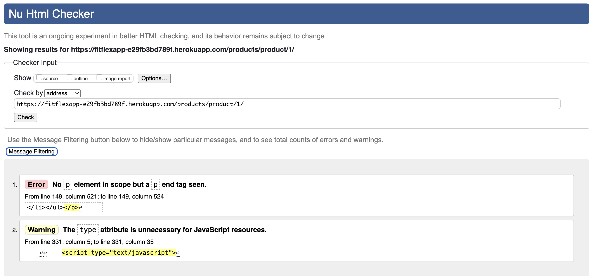
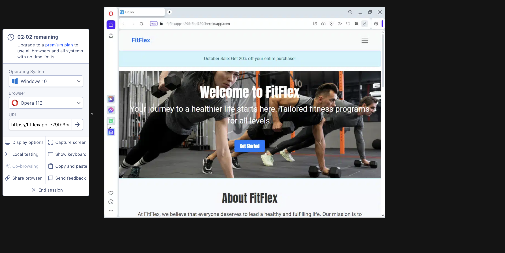

# Testing and Validation
## W3C validation for html**
[W3C html Validator](https://validator.w3.org/nu/)
W3C validation was conducted for all pages and errors were fixed. The only errors not focused were ones related to the type attribute added to script elements. This was deemed unnecessary to fix as they did not affect the function of the website. Additionally, some of these errors seemed to be based on predefined elements in the django.
The images for this validations can be seen [here](ReadmeImages/testingimages/w3chtml)

One error that will require further investigation is:

Looking through the template for the product detail page, I could not find any code relating to the error above. It can be presumed that this is a django-related issue.

## Responsitivity testing
**Cross browser testing**
[site for cross browser testing](https://www.browserling.com/)
The website was verified to work on safari, chrome, opera.


**AMIRESPONSIVE**
Attempt to test responsitivity on amiresponsive was not possible. Upon further investigation in devtools:
Response via console
```
chromewebdata/:1 Refused to display 'https://fitflexapp-e29fb3bd789f.herokuapp.com/' in a frame because it set 'X-Frame-Options' to 'deny'.Understand this error

```
This error is related to the X-Frame-Options HTTP header, which is used to control whether a browser is allowed to display a page inside a `iframe`, `embed`, or `object`element.

**Light house testing**
Lighthouse testing was conducted in devtools to test the performance of the website.
The results of tested parts of the website can be seen [here](ReadmeImages/testingimages/lighthouse)

## Jigsaw CSS Validation
[link](https://jigsaw.w3.org/css-validator/)
Errors identified through out the website had to do with fontawesome. This a future investigation to be carried out.
* [Jigsaw error](ReadmeImages/testingimages/jigsaw/jigsawerrors.png)
* [Jigsaw validation](ReadmeImages/testingimages/jigsaw/jigsawvalidation.png)


## Javascript testing**
[JS-HINT](https://jshint.com/)

**Files tested:**
* Stripe_element.js
  - No siginifciant errors. A statement about stripe variable being undefined.
  Other the warnings:
    ```
    47	'template literal syntax' is only available in ES6 (use 'esversion: 6').
        83	'template literal syntax' is only available in ES6 (use 'esversion: 6').
        90	'template literal syntax' is only available in ES6 (use 'esversion: 6').
    ```

* bag.js
  - No siginifciant errors. 
    ```
    	'template literal syntax' is only available in ES6 (use 'esversion: 6').
    ```

* base.js
  - No siginifciant errors. 
    ```
    		'const' is available in ES6 (use 'esversion: 6') or Mozilla JS extensions (use moz).
    ```

## Flake8
Most of the files displayed e=issues with long lines and trailing whitespace. Most of which were fixed unless there were no compromise such as imports.

**Files tested**

* ./FAQ/views.py
* ./bag/context.py
* ./bag/urls.py
* ./bag/views.py
* ./checkout/admin.py
* ./checkout/forms.py
* ./checkout/models.py
* ./checkout/urls.py
* ./checkout/views.py
* ./checkout/webhook_handler.py
* ./checkout/webhooks.py
* ./fitflex/settings.py
* ./fitflex/urls.py
* ./fitflexproduct/admin.py
* ./fitflexproduct/forms.py
* ./fitflexproduct/models.py
* ./fitflexproduct/urls.py
* ./fitflexproduct/views.py
* ./home/views.py
* ./user_profiles/forms.py
* ./user_profiles/models.py
* ./user_profiles/urls.py
* ./user_profiles/views.py

## Features Testings
<details>
  <summary>Test Cases for Features</summary>
  <table>
    <thead>
      <tr>
        <th>Feature</th>
        <th>Expected Outcome</th>
        <th>Pass/Fail</th>
      </tr>
    </thead>
    <tbody>
      <tr>
        <td>Home Page - Hero Section</td>
        <td>"Get Started" or "Find Your Routine" button directs user to the appropriate page based on login status.</td>
        <td>Pass</td>
      </tr>
      <tr>
        <td>Home Page - Contact Section</td>
        <td>"Contact Us" button directs user to the contact page.</td>
        <td>Pass</td>
      </tr>
      <tr>
        <td>Header - Logo</td>
        <td>Clicking on the logo takes the user back to the home page.</td>
        <td>Pass</td>
      </tr>
      <tr>
        <td>Header - Home Icon</td>
        <td>Clicking the home icon takes the user to the home page.</td>
        <td>Pass</td>
      </tr>
      <tr>
        <td>Header - Shop Icon</td>
        <td>Clicking the shop icon takes the user to the product page.</td>
        <td>Pass</td>
      </tr>
      <tr>
        <td>Header - Bag Icon</td>
        <td>Clicking the bag icon takes the user to the checkout bag page.</td>
        <td>Pass</td>
      </tr>
      <tr>
        <td>Header - Search Bar</td>
        <td>Clicking the search bar opens the search function (if implemented).</td>
        <td>Pass</td>
      </tr>
      <tr>
        <td>Sign In Button (Header)</td>
        <td>Clicking "Sign In" button redirects the user to the login page.</td>
        <td>Pass</td>
      </tr>
      <tr>
        <td>Sign Up Button (Header)</td>
        <td>Clicking "Sign Up" button redirects the user to the registration page.</td>
        <td>Pass</td>
      </tr>
      <tr>
        <td>Sign In Page - Login Form</td>
        <td>User can enter valid credentials, and upon submission, they are redirected to their destination (home, profile, etc.).</td>
        <td>Pass</td>
      </tr>
      <tr>
        <td>Sign Up Page - Registration Form</td>
        <td>User can register with valid details, and upon successful registration, they are redirected to their profile or home page.</td>
        <td>Pass</td>
      </tr>
      <tr>
        <td>Sign Up Page - Error Handling</td>
        <td>If invalid or missing credentials are provided, the user receives an error message indicating what needs to be corrected.</td>
        <td>Pass</td>
      </tr>
      <tr>
        <td>Logout Button (Header)</td>
        <td>Clicking the logout button redirects the user to the logout page.</td>
        <td>Pass</td>
      </tr>
      <tr>
        <td>Logout Page - Confirmation Prompt</td>
        <td>A confirmation message appears asking the user if they are sure they want to log out.</td>
        <td>Pass</td>
      </tr>
      <tr>
        <td>Logout Page - Cancel Button</td>
        <td>Clicking the "Cancel" button redirects the user back to the home page.</td>
        <td>Pass</td>
      </tr>
      <tr>
        <td>Logout Page - Sign Out Button</td>
        <td>Clicking the "Sign Out" button successfully logs the user out and redirects them to the home page or login page.</td>
        <td>Pass</td>
      </tr>
      <tr>
        <td>Footer - Contact Us Button</td>
        <td>Clicking the "Contact Us" link directs user to the contact page.</td>
        <td>Pass</td>
      </tr>
      <tr>
        <td>Footer - Newsletter Submit Button</td>
        <td>Clicking the newsletter subscription button triggers a success toast and does not navigate away.</td>
        <td>Pass</td>
      </tr>
      <tr>
        <td>Footer - Social Media Icons</td>
        <td>Clicking each social media icon navigates the user to the respective social media site (Facebook, Twitter, Instagram, etc.).</td>
        <td>Pass</td>
      </tr>
      <tr>
        <td>Footer - About Button</td>
        <td>Clicking the "About" button in the footer correctly scrolls the user down to the About section on the home page.</td>
        <td>Pass</td>
      </tr>
      <tr>
        <td>FAQ Page</td>
        <td>Clicking on FAQ questions allows users to view the full answer; admin can delete questions and users can ask a new question.</td>
        <td>Pass</td>
      </tr>
      <tr>
        <td>FAQ - Ask Question Button</td>
        <td>Clicking the "Ask Question" button directs user to the "Ask a Question" page.</td>
        <td>Pass</td>
      </tr>
      <tr>
        <td>FAQ - Review Button</td>
        <td>Admin can click to "Review" any submitted questions, directing them to the FAQ review page.</td>
        <td>Pass</td>
      </tr>
      <tr>
        <td>Workout Page - Filter</td>
        <td>Clicking any of the filter options (category, difficulty, price) updates the product list to match the filter selection.</td>
        <td>Pass</td>
      </tr>
      <tr>
        <td>Workout Page - Product Card</td>
        <td>Clicking the "Read More" button on a product card takes the user to the product detail page.</td>
        <td>Pass</td>
      </tr>
      <tr>
        <td>Product Detail Page - Add to Bag Button</td>
        <td>Clicking "Add to Bag" button adds the product to the bag and displays a toast notification confirming the action.</td>
        <td>Pass</td>
      </tr>
      <tr>
        <td>Product Detail Page - Review Button</td>
        <td>Clicking the "Add Review" button opens a review form.</td>
        <td>Pass</td>
      </tr>
      <tr>
        <td>Product Review Page - Edit/Delete Button</td>
        <td>Clicking the "Edit" or "Delete" buttons on the review allows users to edit or delete their comments (admin can delete any review).</td>
        <td>Pass</td>
      </tr>
      <tr>
        <td>Bag Page - Remove Item Button</td>
        <td>Clicking "Remove" next to an item in the bag triggers a toast confirming the removal and updates the bag contents.</td>
        <td>Pass</td>
      </tr>
      <tr>
        <td>Bag Page - Checkout Button</td>
        <td>Clicking the "Checkout" button takes the user to the checkout page.</td>
        <td>Pass</td>
      </tr>
      <tr>
        <td>Checkout Page - Payment Submit Button</td>
        <td>Clicking "Complete Order" completes the payment and redirects the user to the checkout success page.</td>
        <td>Pass</td>
      </tr>
      <tr>
        <td>Checkout Page - Cancel Checkout Button</td>
        <td>Clicking "Cancel Checkout" prompts a confirmation and returns the user to the product page if confirmed.</td>
        <td>Pass</td>
      </tr>
      <tr>
        <td>Checkout Page - Continue Shopping Button</td>
        <td>On the success page, clicking "Continue Shopping" redirects the user to the product page.</td>
        <td>Pass</td>
      </tr>
      <tr>
        <td>Checkout Bag - Remove Item Button</td>
        <td>Clicking "Remove" next to an item in the bag triggers a toast confirming the removal and updates the bag contents.</td>
        <td>Pass</td>
      </tr>
      <tr>
        <td>Checkout Bag - Checkout Button</td>
        <td>Clicking the "Checkout" button takes the user to the checkout page.</td>
        <td>Pass</td>
      </tr>
    </tbody>
  </table>
</details>
